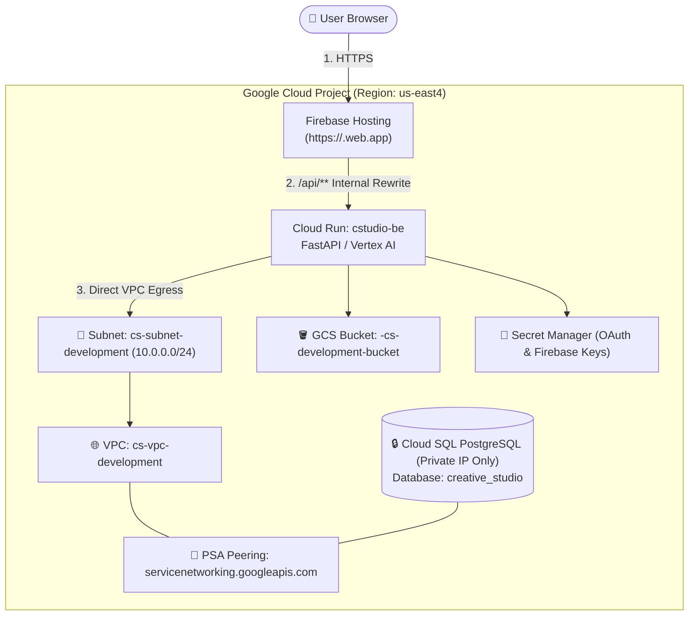

# GCC Creative Studio: Complete End-to-End Deployment Guide

This guide provides complete, production-grade instructions for deploying **Google Cloud Vertex AI Creative Studio** into a fresh GCP project. It covers both **Method 1 (Disconnected / IaC Mode)** and **Method 2 (Interactive `bootstrap.sh` Mode)**, including all IAM permissions, OAuth configurations, and database seeding procedures.

---

## 🏗️ 1. Architecture Overview



---

## 📋 2. Prerequisites & Project Setup (One-Time)

### A. Required User Permissions / IAM Roles
The deploying identity must have **`roles/owner`** (Recommended) or the following granular roles:
* `roles/resourcemanager.projectIamAdmin` (IAM bindings for build and run service accounts)
* `roles/serviceusage.serviceUsageAdmin` (Enabling Google Cloud APIs)
* `roles/iam.serviceAccountAdmin` & `roles/iam.serviceAccountUser`
* `roles/compute.networkAdmin` & `roles/servicenetworking.networksAdmin`
* `roles/cloudsql.admin`
* `roles/run.admin`
* `roles/secretmanager.admin`
* `roles/storage.admin`
* `roles/artifactregistry.admin`
* `roles/cloudbuild.builds.editor`
* `roles/firebase.admin` & `roles/firebasehosting.admin`

---

### B. Project Creation & Initial Authentication
```bash
export NEW_PROJECT_ID="your-new-project-id"
export REGION="us-east4"
export BILLING_ACCOUNT_ID="01XXXX-XXXXXX-XXXXXX" # Check with: gcloud billing accounts list

# 1. Create and link project
gcloud projects create $NEW_PROJECT_ID --name="Creative Studio"
gcloud billing projects link $NEW_PROJECT_ID --billing-account=$BILLING_ACCOUNT_ID
gcloud config set project $NEW_PROJECT_ID

# 2. Enable Early Bootstrap APIs
gcloud services enable cloudbuild.googleapis.com secretmanager.googleapis.com --project=$NEW_PROJECT_ID

# 3. Authenticate gcloud & Firebase CLI
gcloud auth login
gcloud auth application-default login
gcloud auth application-default set-quota-project $NEW_PROJECT_ID
firebase login --no-localhost
```

---

### C. Configure OAuth Consent Screen & Web Client ID
1. Go to [Google Cloud Console ➔ APIs & Services ➔ OAuth consent screen](https://console.cloud.google.com/apis/credentials/consent).
   * **User Type**: `Internal` (for Google Workspace org) or `External`.
   * Fill in **App Name**, **User support email**, and **Developer contact email**, then click **Save and Continue**.
2. Go to [APIs & Services ➔ Credentials](https://console.cloud.google.com/apis/credentials).
3. Click **Create Credentials ➔ OAuth Client ID**:
   * **Application type**: `Web application`
   * **Name**: `Creative Studio Web Client`
   * **Authorized JavaScript origins**:
     ```text
     https://<NEW_PROJECT_ID>.web.app
     https://<NEW_PROJECT_ID>.firebaseapp.com
     http://localhost:4200
     http://localhost:8080
     ```
   * **Authorized redirect URIs**:
     ```text
     https://<NEW_PROJECT_ID>.firebaseapp.com/__/auth/handler
     https://<NEW_PROJECT_ID>.web.app/__/auth/handler
     http://localhost:4200
     http://localhost:8080/api/auth/callback
     ```
4. Copy the generated **Client ID** (e.g. `123456789-xxxx.apps.googleusercontent.com`).

---

### D. Link Firebase & Enable Google Auth Provider
1. Open the [Firebase Console](https://console.firebase.google.com/).
2. Click **Add Project** ➔ Select your existing Google Cloud project (`$NEW_PROJECT_ID`) ➔ Accept terms.
3. In the left navigation, go to **Build ➔ Authentication** ➔ Click **Get Started**.
4. In the **Sign-in method** tab, click **Google** ➔ Toggle **Enable** ➔ Set **Project support email** ➔ Click **Save**.
5. In **Project Settings** (⚙️) ➔ **General** ➔ Click **Add app** (Web `</>`):
   * App nickname: `Creative Studio Web`
   * Check **"Also set up Firebase Hosting"**.
   * Note down the Firebase config values (`apiKey`, `authDomain`, `appId`, etc.).

---

### E. Fork the Repository & Connect Cloud Build
1. Fork repository **`https://github.com/PKAgarwal157/gcc-creative-studio`** (Make sure branch `private-ip-cloudsql-7-Aug` is included).
2. Go to [Cloud Build Repositories (2nd gen)](https://console.cloud.google.com/cloud-build/repositories/2nd-gen).
3. Click **CREATE HOST CONNECTION**:
   * **Provider**: GitHub
   * **Connection Name**: `cstudio-github-con`
   * **Region**: `us-east4`
4. Click **LINK REPOSITORY** and link your forked `gcc-creative-studio` repo.

---

## ⚡ Method 2: The Interactive `bootstrap.sh` Method

The interactive bootstrap script guides you through setting up infrastructure, secrets, and Cloud Build triggers in one flow.

### Step 1: Set Customer Admin Account & Region
```bash
# Set your active gcloud account to the customer's administrator email:
gcloud config set account customer-admin@customer.com

# Verify region configuration in the forked repo:
# In infra/environments/dev-infra-example/dev.tfvars:
#   gcp_region = "us-east4"
# In bootstrap.sh lines 784-785:
#   --region="us-east4"
```

---

### Step 2: Run `bootstrap.sh`
```bash
cd gcc-creative-studio
chmod +x bootstrap.sh
./bootstrap.sh
```

#### Interactive Prompts Walkthrough:
1. **Prerequisites & Terraform**: Script auto-detects `gcloud`, `git`, `jq`, `uv`, and installs Terraform `1.14.1` into `~/bin`.
2. **Project ID**: Enter your new Project ID (`$NEW_PROJECT_ID`).
3. **Repository URL**: Enter `https://github.com/<YOUR_USER>/gcc-creative-studio.git` and select branch **`main`** (or `private-ip-cloudsql-7-Aug`).
4. **Environment Name**: Press `[Enter]` for default (`dev-infra`).
5. **GCS State Bucket**: Type `n` (Script auto-creates `gs://<PROJECT_ID>-cstudio-dev-infra-tfstate`) or enter the exact bucket name if `y`.
6. **Host Connection**: Enter **`cstudio-github-con`**.
7. **OAuth Client ID**: Paste your generated **OAuth 2.0 Web Client ID**.
8. **Firebase App**: Script auto-creates Firebase web app `cstudio-fe` and extracts SDK keys.
9. **Terraform Apply**: Type **`y`** to provision VPC, Subnet, Cloud SQL PostgreSQL, Buckets, and Cloud Run (~8 mins).
10. **Populate Secrets & Trigger Builds**: Script populates Secret Manager and triggers backend/frontend builds.

---

### Step 3: Post-Bootstrap Steps (Critical for Private IP & Ingress)

Because `bootstrap.sh` provisions a private IP database and Firebase Hosting rewrites, run these post-deployment steps:

#### 1. Allow Firebase Hosting to Invoke Cloud Run:
> **Why `allUsers` is required:** Firebase Hosting acts as a transparent public reverse proxy for `/api/**` rewrites without injecting internal Google IAM tokens. Cloud Run requires `roles/run.invoker` for `allUsers` at the network layer to accept proxied traffic. Application-level security is strictly enforced by FastAPI backend middleware (which verifies Google OAuth 2.0 JWT tokens on every protected endpoint).

```bash
gcloud run services add-iam-policy-binding cstudio-be \
  --region=us-east4 \
  --project=$NEW_PROJECT_ID \
  --member="allUsers" \
  --role="roles/run.invoker"
```

#### 2. Seed Database Tables & 47 AI Templates (Serverless Cloud Run Job):
```bash
DB_INSTANCE=$(gcloud sql instances list --project=$NEW_PROJECT_ID --format='value(name)')
DB_CONN=$(gcloud sql instances list --project=$NEW_PROJECT_ID --format='value(connectionName)')

# A. Ensure Database Catalog & Password are ready
gcloud sql databases create creative_studio --instance="${DB_INSTANCE}" --project=$NEW_PROJECT_ID 2>/dev/null || true

# B. Get deployed container image tag
IMAGE_URI=$(gcloud artifacts docker images list us-east4-docker.pkg.dev/${NEW_PROJECT_ID}/cs-be-development-repo --format='value(format("{0}:{1}", package, version))' | head -n 1)

# C. Deploy Seeding Job inside the Private VPC
gcloud run jobs deploy seed-data-full \
  --image="${IMAGE_URI}" \
  --region=us-east4 \
  --project=$NEW_PROJECT_ID \
  --service-account="cs-be-development-run@${NEW_PROJECT_ID}.iam.gserviceaccount.com" \
  --network="projects/${NEW_PROJECT_ID}/global/networks/cs-vpc-development" \
  --subnet="projects/${NEW_PROJECT_ID}/regions/us-east4/subnetworks/cs-subnet-development" \
  --set-cloudsql-instances="${DB_CONN}" \
  --set-env-vars=DB_USER="studio_user",DB_NAME="creative_studio",INSTANCE_CONNECTION_NAME="${DB_CONN}",ADMIN_USER_EMAIL="customer-admin@customer.com",GENMEDIA_BUCKET="${NEW_PROJECT_ID}-cs-development-bucket",DB_IP_TYPE="PRIVATE",PYTHONPATH="/app" \
  --set-secrets=DB_PASS=creative-studio-db-password:latest \
  --command="/app/.venv/bin/python" \
  --args="-m,bootstrap.bootstrap" \
  --quiet

# D. Execute Seeding Job
gcloud run jobs execute seed-data-full --region=us-east4 --project=$NEW_PROJECT_ID --wait
```

---

## 🛠️ Method 1: The Disconnected / IaC Method (No `bootstrap.sh`)

If you prefer manual, step-by-step Terraform and Cloud Build execution:

### Step 1: Secret Manager Setup
```bash
gcloud services enable secretmanager.googleapis.com --project=$NEW_PROJECT_ID

echo -n "YourSecureDBPassword123!" | gcloud secrets create creative-studio-db-password --data-file=- --project=$NEW_PROJECT_ID
echo -n "YOUR_OAUTH_CLIENT_ID.apps.googleusercontent.com" | gcloud secrets create GOOGLE_CLIENT_ID --data-file=- --project=$NEW_PROJECT_ID
echo -n "YOUR_OAUTH_CLIENT_ID.apps.googleusercontent.com" | gcloud secrets create GOOGLE_TOKEN_AUDIENCE --data-file=- --project=$NEW_PROJECT_ID
echo -n "<FIREBASE_API_KEY>" | gcloud secrets create FIREBASE_API_KEY --data-file=- --project=$NEW_PROJECT_ID
echo -n "$NEW_PROJECT_ID.firebaseapp.com" | gcloud secrets create FIREBASE_AUTH_DOMAIN --data-file=- --project=$NEW_PROJECT_ID
echo -n "$NEW_PROJECT_ID" | gcloud secrets create FIREBASE_PROJECT_ID --data-file=- --project=$NEW_PROJECT_ID
echo -n "$NEW_PROJECT_ID.firebasestorage.app" | gcloud secrets create FIREBASE_STORAGE_BUCKET --data-file=- --project=$NEW_PROJECT_ID
echo -n "YOUR_MESSAGING_SENDER_ID" | gcloud secrets create FIREBASE_MESSAGING_SENDER_ID --data-file=- --project=$NEW_PROJECT_ID
echo -n "1:xxxx:web:xxxx" | gcloud secrets create FIREBASE_APP_ID --data-file=- --project=$NEW_PROJECT_ID
echo -n "G-XXXXXXX" | gcloud secrets create FIREBASE_MEASUREMENT_ID --data-file=- --project=$NEW_PROJECT_ID
```

### Step 2: Apply Terraform
```bash
cd infra/environments/dev-infra
terraform init
terraform apply -var-file="dev-infra.tfvars" -auto-approve
cd ../../..
```

### Step 3: Grant Build Service Account Roles
```bash
PROJECT_NUM=$(gcloud projects describe $NEW_PROJECT_ID --format='value(projectNumber)')
for SA in "${PROJECT_NUM}@cloudbuild.gserviceaccount.com" "${PROJECT_NUM}-compute@developer.gserviceaccount.com"; do
  gcloud projects add-iam-policy-binding $NEW_PROJECT_ID --member="serviceAccount:${SA}" --role="roles/secretmanager.secretAccessor"
  gcloud projects add-iam-policy-binding $NEW_PROJECT_ID --member="serviceAccount:${SA}" --role="roles/artifactregistry.writer"
  gcloud projects add-iam-policy-binding $NEW_PROJECT_ID --member="serviceAccount:${SA}" --role="roles/logging.logWriter"
  gcloud projects add-iam-policy-binding $NEW_PROJECT_ID --member="serviceAccount:${SA}" --role="roles/run.admin"
  gcloud projects add-iam-policy-binding $NEW_PROJECT_ID --member="serviceAccount:${SA}" --role="roles/iam.serviceAccountUser"
  gcloud projects add-iam-policy-binding $NEW_PROJECT_ID --member="serviceAccount:${SA}" --role="roles/firebasehosting.admin"
done
```

### Step 4: Build Backend, Deploy & Seed Database
```bash
# 1. Build Backend Image
gcloud builds submit backend \
  --config=backend/cloudbuild.yaml \
  --project=$NEW_PROJECT_ID \
  --substitutions=_REGION="us-east4",_REPO_NAME="cs-be-development-repo",_IMAGE_NAME="cstudio-be",COMMIT_SHA="latest"

# 2. Grant allUsers invoker
gcloud run services add-iam-policy-binding cstudio-be \
  --region=us-east4 \
  --project=$NEW_PROJECT_ID \
  --member="allUsers" \
  --role="roles/run.invoker"

# 3. Seed Database via Cloud Run Job (Step 3.2 above)
```

### Step 5: Build & Deploy Frontend (Firebase Hosting)
```bash
gcloud builds submit . \
  --config=frontend/cloudbuild-deploy.yaml \
  --project=$NEW_PROJECT_ID \
  --substitutions=_REGION="us-east4",_FE_SERVICE_NAME="cstudio-fe",_BACKEND_URL="https://${NEW_PROJECT_ID}.web.app",_FIREBASE_SITE_ID="${NEW_PROJECT_ID}",_BACKEND_SERVICE_ID="cstudio-be"
```

---

## ✅ 4. Final Verification & Testing

1. **Verify Backend Health**:
   ```bash
   curl -s -i "https://${NEW_PROJECT_ID}.web.app/api/version"
   # Output: HTTP/2 200 OK -> "v0.0.1"
   ```
2. **Open Web Application**:
   * Navigate to: **`https://<NEW_PROJECT_ID>.web.app`**
   * Click **"Sign in with Google"** with your customer admin email.
   * Verify that user sync succeeds without toast errors.
   * Verify the 47 default templates load in the template library.
   * Type a prompt (e.g. *"A red sports car on a mountain road"*) and click **✨ Generate** to test the Vertex AI pipeline.
